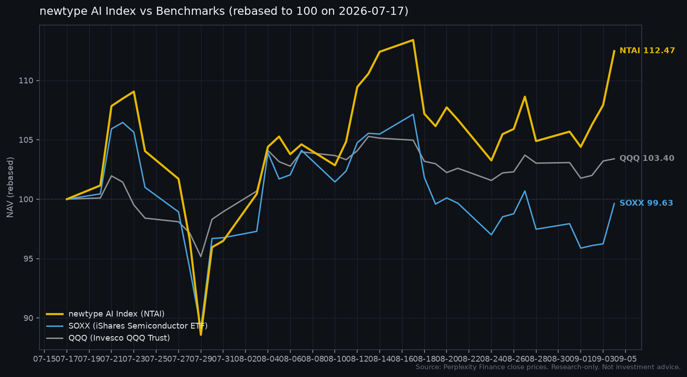

# newtype AI Index

**中文** · [English](README_EN.md)

**代号:NTAI** · **起始日:2026-07-17** · **初始净值:100.0000** · **计价货币:USD**

用一条净值曲线,把 [newtype-equity](https://github.com/newtype-01/newtype-equity) 的七层AI产业链框架和AI产业链低频信号系统的判断,收敛成任何人可以每日检验的公开记录。

Index不是基金,不是投资建议,不接受AUM。它只做一件事:**把方法论的判断放在时间戳可查的地方,让事后有据可对**。

---

## 最新净值

| 指标 | 值 |
|---|---|
| 最新交易日 | 2026-07-31 |
| NTAI净值 | **96.4920** |
| NTAI期间收益 | **-3.51%** |
| SOXX期间收益 | -3.24% |
| QQQ期间收益 | -1.06% |
| 相对SOXX超额 | **-0.27pp** |
| 相对QQQ超额 | **-2.45pp** |

## 净值曲线



**开局解读**:07-17到07-23,Index前期把SOXX和QQQ都甩开约8个百分点,峰值109。07-24起AI板块整体回撤,07-29出现单日跳崖(NVDA单日-3.6%,MU-10%,VRT-17%,NBIS-12%)。反弹阶段QQQ因分散度更高恢复更快,Index与SOXX同步反弹但未回到基准。**首月净值跑输SOXX 0.27pp、跑输QQQ 2.45pp**。

这段回撤没有被藏起来。事实上,Index从建立起就是研究记录用的,而不是宣传素材。

## 当前成分(生效日2026-07-17)

| Ticker | 名称 | 层 | 层名 | Tier | 权重 |
|---|---|---|---|---|---|
| NVDA | NVIDIA | L4 | Compute Hardware | Core | 22% |
| MU | Micron | L3 | Interconnect & Memory | Core | 22% |
| VRT | Vertiv | L2 | Infrastructure | Core | 22% |
| CEG | Constellation Energy | L1 | Energy | N-Stack | 12% |
| TSM | Taiwan Semi | L4 | Compute Hardware | Bridge | 10% |
| MRVL | Marvell | L4 | Compute Hardware | N-Stack | 6% |
| NBIS | Nebius | L5 | Cloud / IaaS | N-Stack | 6% |

- 层覆盖:**L1-L5**(能源到IaaS),L6/L7因估值离散度过大暂不纳入
- Tier分布:Core 66% · N-Stack 24% · Bridge 10%
- 权重合计:**100%**(纯AI敞口,无现金缓冲)

完整成分定义(含scarcity、shovel-vs-gold、endgame view等属性)见 [`data/constituents/2026-07-17.json`](data/constituents/2026-07-17.json)。

## 时间不对称的诚实标注

本仓库首次公开commit **在2026-08-01**,晚于Index起始日(2026-07-17)。也就是07-17到07-31的净值曲线,是回填计算,不是当时实时发布的记录。

为避免混淆:

- 成分选择完全来自AI产业链低频信号系统的baseline判断(as_of 2026-07-19),那份判断的git commit时间戳在私有仓库里,可以独立验证
- 未来任何成分调整,**必须在生效日之前commit**到本仓库,不允许事后改历史文件(git append-only)
- 老constituents文件永远不动,新调整只加新文件

Index的可信度来自"公开可验证的调仓时间戳",这是它跟社交媒体口播式喊单的核心区别。

## 仓库结构

```
newtype-ai-index/
├── README.md                       # 中文版(默认)
├── README_EN.md                    # English version
├── LICENSE                         # MIT
├── docs/
│   └── methodology.md              # 方法论全文
├── data/
│   ├── constituents/
│   │   └── 2026-07-17.json         # 生效日的完整成分定义
│   ├── prices/
│   │   └── close_prices.csv        # 成分和基准的日收盘价
│   ├── nav/
│   │   ├── daily.csv               # NTAI日净值
│   │   └── monthly.csv             # NTAI月末净值
│   └── benchmarks/
│       └── comparison.csv          # NTAI vs SOXX vs QQQ(rebased)
├── charts/
│   └── nav-comparison.png          # 对比曲线
└── scripts/
    ├── calculate_nav.py            # 净值计算(标准库)
    └── generate_chart.py           # 曲线生成(matplotlib)
```

## 复现方法

```bash
# 需要Python 3.10+和matplotlib
python3 scripts/calculate_nav.py
python3 scripts/generate_chart.py
```

价格数据在 `data/prices/close_prices.csv`,来自Perplexity Finance。如果想用你自己的数据源(Yahoo Finance、Alpha Vantage等),替换这个CSV,列名保持 `date,ticker,close` 即可。

## 免责

- **Index是研究工具,不是投资产品**。不构成买入或卖出信号,不构成投资建议
- **成分权重是模型目标,不是本人实际持仓**
- **过往净值不代表未来表现**
- **本Index的构建方是散户个人,不是持牌机构**。不接受AUM,不代客理财

## 相关仓库

- [newtype-equity](https://github.com/newtype-01/newtype-equity) — 七层AI产业链分析框架skill(公开)
- AI产业链低频信号系统 — 低频信号系统与月度报告(私有)

## 许可

MIT · Copyright © 2026 Huang Yihe

---

## Links

- YouTube: [youtube.com/@huanyihe777](https://www.youtube.com/@huanyihe777)
- Twitter: [x.com/huangyihe](https://x.com/huangyihe)
- Substack: [newtype.pro](https://newtype.pro/)
